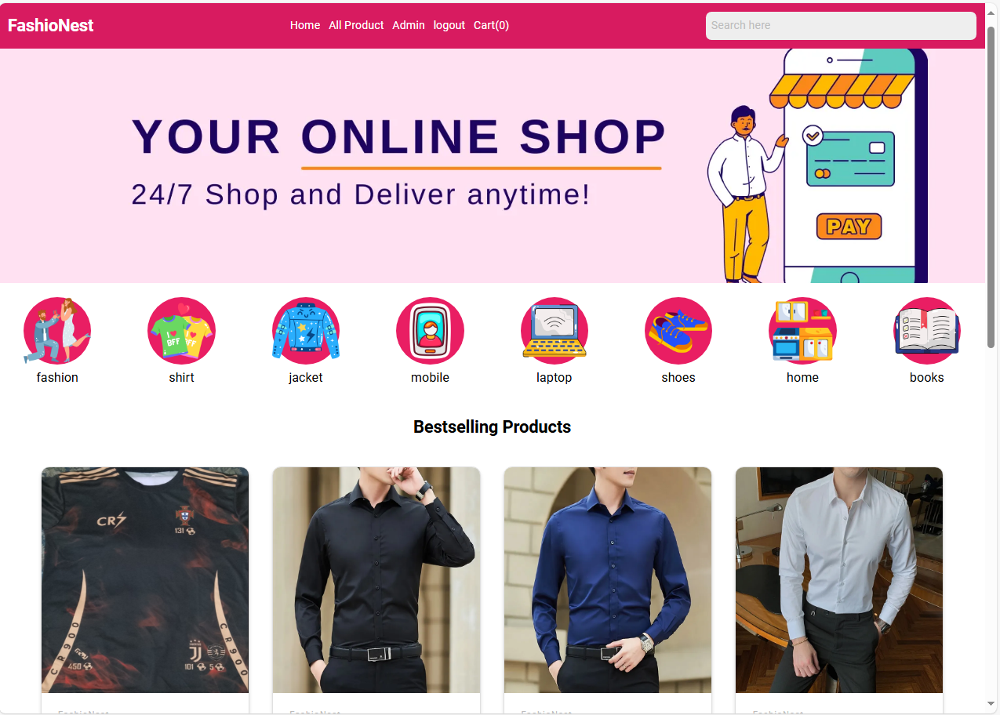
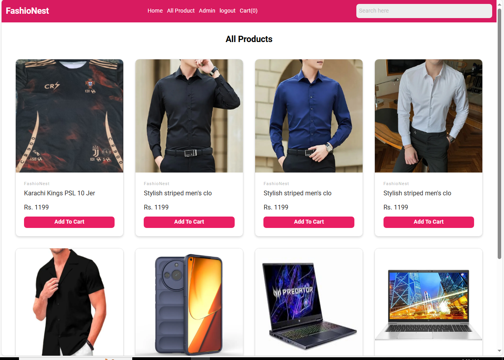
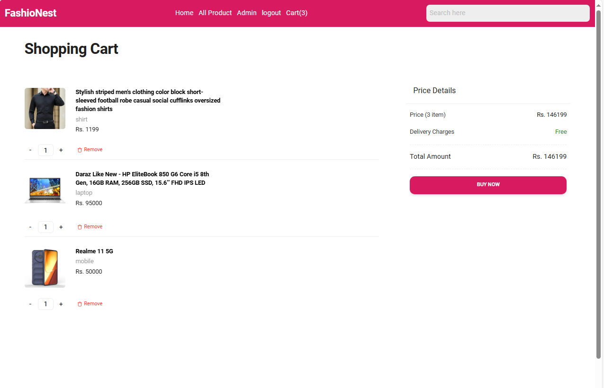
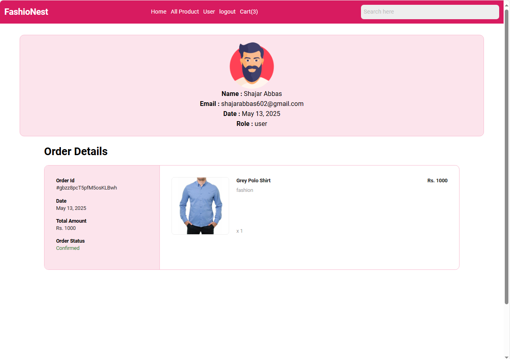
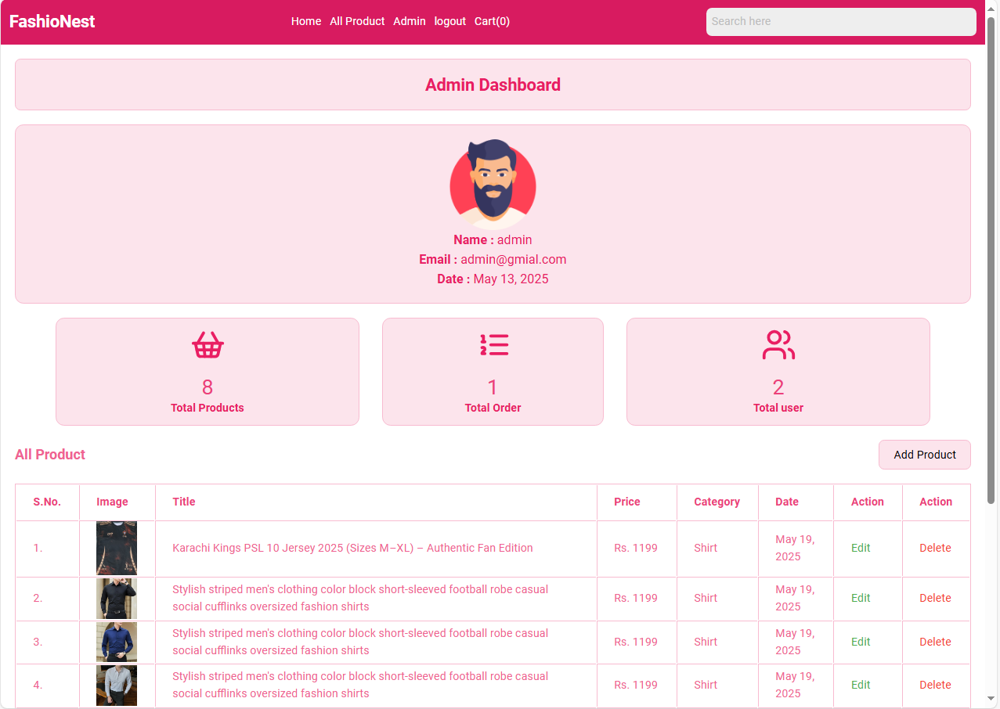
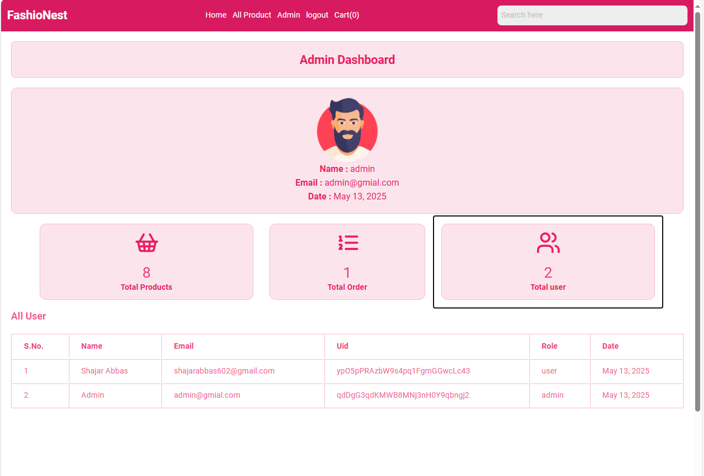
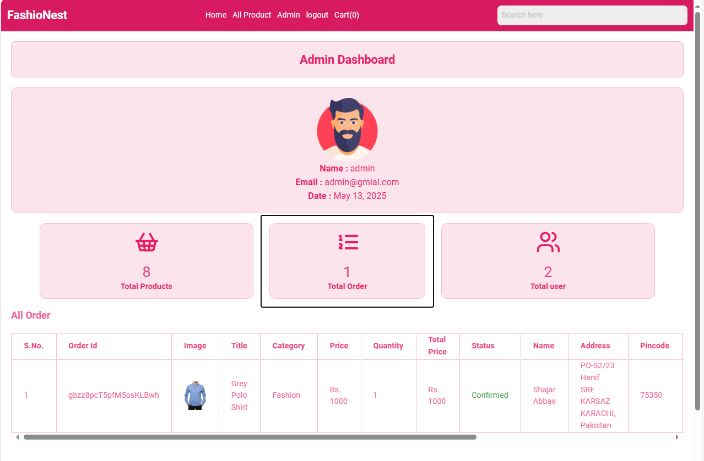
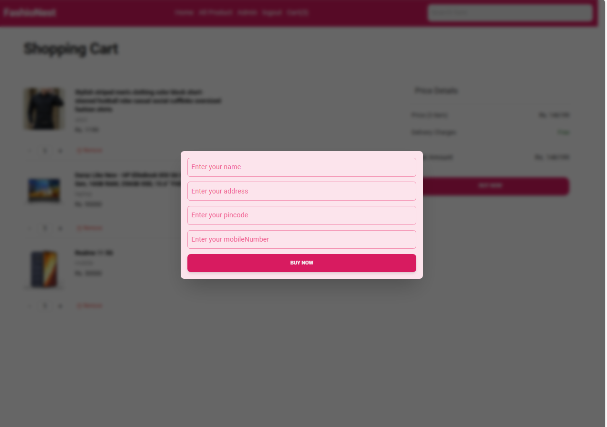

# 🛍️ E-Commerce Website (React + Firebase)

This is a responsive E-Commerce web app built using **ReactJS** for the frontend and **Firebase** for backend services like authentication and Firestore database.

## 🚀 Features

* User Sign Up & Login (with Firebase Auth)
* Add to Cart and Checkout Flow
* Firestore Realtime Database Integration
* Product Management for Admin
* Responsive Design for all devices
* Protected Routes and Local Storage

---


## 🔧 Firebase Setup

1. Go to your Firebase Console and create a new project.
2. Enable **Authentication** (Email/Password).
3. Enable **Firestore Database**.
4. In your React project, navigate to:

```
src/firebase/
```

5. Create a new file: `FirebaseConfig.jsx`
6. Paste the following code into it **(replace with your own credentials!)**:

```js
import { initializeApp } from "firebase/app";
import { getFirestore } from 'firebase/firestore';
import { getAuth } from 'firebase/auth';

const firebaseConfig = {
  apiKey: "YOUR_API_KEY",
  authDomain: "YOUR_AUTH_DOMAIN",
  projectId: "YOUR_PROJECT_ID",
  storageBucket: "YOUR_STORAGE_BUCKET",
  messagingSenderId: "YOUR_MESSAGING_SENDER_ID",
  appId: "YOUR_APP_ID"
};

const app = initializeApp(firebaseConfig);

const fireDB = getFirestore(app);
const auth = getAuth(app);

export { fireDB, auth };
```

❗ **Important:** Never push your real Firebase credentials to a public repo. Use `.env` files in production.

---

## 🧪 Run Locally

```bash
git clone https://github.com/SHAJAR5110/e-commerce.git
cd e-commerce
npm install
npm start
```

---

## 🌐 Live Demo

Coming Soon (or add your deployed Firebase hosting link here)

---

## 🛠️ Tech Stack

* ReactJS
* Firebase Auth
* Firebase Firestore
* React Router
* LocalStorage

---

## 👤 Author

**Shajar Abbas**
🔗 [LinkedIn](https://www.linkedin.com/in/shajar-abbas-45a855268/)
📁 [Portfolio](https://shajarabbas.vercel.app/)
✨ [GitHub](https://github.com/SHAJAR5110)

---

## 🖼️ App Screenshots

Here is a preview of the app interface:



  
  
  
  
  
  
  

